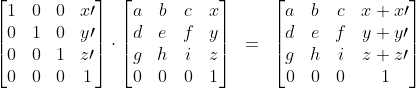
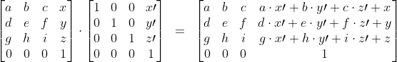
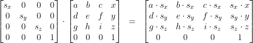
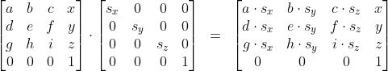
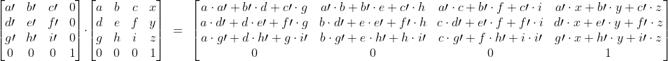
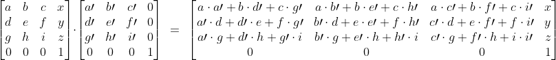
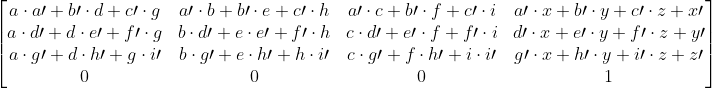

Title: Enable transform chaining by making scaled/rotated/translated consistent

A guitar practicing application ([here](https://www.youtube.com/watch?v=odWXE5Dv9HQ) is an old version but in VR).

I suspect the reasons why I'm facing this issue more than other may be:
- Almost all geometry/meshes are procedurally generated.
- Because of usage of `MultiMeshInstance` I can't rely less on node hierarchies, but have to compute complex transformation chains manually.
- I like fluent interfaces ;)

However the issue I'm facing is a fairly fundamental one, and can affect almost any project.

# Issue

Basically every time I try to chain `.scaled`/`.rotated`/`.translated` I end up with a bug.
I had raised this issue before https://github.com/godotengine/godot/issues/34329, which has
been closed by adding a line to the documentation. This line didn't help much, I still run into
the same problem a lot. I finally had the time to analyze why that is, and since 4.0
is the chance to get things right, here is my proposal.

Note: I'm discussing the topic based on `Transform`, but both the problem and solution would also
apply for `Transform2D` as far as I can see.

## General notes

Chaining transformation always requires to be aware of left-to-right or right-to-left thinking,
because the "mathematical reading order" is typically opposite to the "transformation order".
For instance
```
x' = C · B · A · x
```
first transforms `x` by `A`, then by `B`, then by `C`, opposite to how the mathematical equation is typically written.
Put another way:

- Transform left multiplication
  ```
  M' = A · M
  ```
  means that `A` is applied _after_ `M` is applied.

- Transform right multiplication
  ```
  M' = M · A
  ```
  means that `A` is applied _before_ `M` is applied.

## Current behavior

Currently the behavior is a mix of left and right multiplication.

- Scaled:
  ```
  var M_new = M.scaled(... S ...)
  ```
  has **left** multiplication semantics (i.e., happens _after_ in transformation order):
  ```
  M_new = S · M
  ```

- Rotated:
  ```
  var M_new = M.rotated(... R ...)
  ```
  has **left** multiplication semantics (i.e., happens _after_ in transformation order):
  ```
  M_new = R · M
  ```

- Translated:
  ```
  var M_new = M.translated(... T ...)
  ```
  has **right** multiplication semantics (i.e., happens _before_ in transformation order):
  ```
  M_new = M · T
  ```

## Issue 1: Hard to read

Because of mixing left and right multiplication, I find it fairly hard to look at chained
expressions and come up with the underlying mathematical order. Going from the code to the
mathematical expression cannot be done by just reading in one direction, but rather requires to
switch between left-to-right and right-to-left thinking. For instance:

```gdscript
var M = Transform.IDENTITY\
    .scaled(... S ...)\
    .translated(... T ...)\
    .rotated(... R ...)
```
is equivalent to (if I didn't get it wrong again)
```
M = R · S · T
```
Note how `R` has moved from last to first, `S` has moved to the middle, and `T` ended up at the end.
The result feels almost like a random shuffle of the order written in the code.
Doing such transformations on longer expressions is a challenging (and unnecessary) mental exercise.

## Issue 2: Hard to write

The problem is even more tricky the other way around, when trying to convert a mathematical expression into code.

_Example 1_: Imagine your goal is to write the following purely with chaining:
```
M = S · T · R
```
It turns out that this actually cannot be written purely with chaining, because having the `.translated`
in the middle breaks the right-to-left flow, and there is no way get the `R` in the right position.

The only way to write it is in a non-chained way, for instance:
```gdscript
var M = Transform.IDENTITY\
    .scaled(... S ...)
    .translated(... T ...)
M *= Transform.IDENTITY.rotated(... R ...)
```

_Example 2_: Imagine implementing longer transform chains like:
```
M = R_2 · T_2 · R_1 · S_2 · T_1 · S_1
```
Trying to work out the code becomes more and more awkward, because it is necessary
to split the expression into subgroups at each `T_*`, which break the right-to-left
flow. The individual groups can be assembled right-to-left, but need to be assembled
in an outer multiplication left-to-right. An alternative is to manually implement
translation left multiplication with the trick to use `temporary.offset += T_*`.
In any case the resulting code is much less clear than a full chaining expression (if `.translated` would do left-multiplication as well):
```gdscript
var M = Transform.IDENTITY\
    .scaled(... S_1 ...)\
    .translated(... T_1 ...)\
    .scaled(... S_2 ...)\
    .rotated(... R_1 ...)\
    .translated(... T_2 ...)\
    .rotated(... R_2 ...)
```

## Issue 3: Performance aspects

In general writing transforms as chains is faster than using full `transform1 * transform2` expressions,
because the implementation can exploit the particular matrix properties of `.scaled`/`.rotated`/`.translated`.
However, because of the error prone chaining semantics, I have basically replaced many transform chains
by transform product expressions, which has performance drawbacks.

I had to refresh my memory about the differences, in case you are interested in the details:

<details>
<summary>All possible transform operations</summary>

## Translation

**Left multiply**



**Right multiply**




## Scale

**Left multiply**



**Right multiply**




## Rotation

**Left multiply**



**Right multiply**




## Generic transform

**Left multiply (rhs only)**


**Right multiply (rhs only)**



</details>

Counting the number of floating point operations gives:

| Operation                     | # Floating point operations | available |
|-------------------------------|----------------------------:|:---------:|
| Translation (left multiply)   |                           3 |           |
| Translation (right multiply)  |                          18 |     *     |
| Scale (left multiply)         |                          12 |     *     |
| Scale (right multiply)        |                           9 |           |
| Rotation (left multiply)      |                          60 |     *     |
| Rotation (right multiply)     |                          45 |           |
| Translation (both directions) |                          63 |     *     |

It is interesting to see how much more costly a full `transform1 * transform2` (63 ops)
is compared to a simple translation left multiply (3 ops).
The other aspect I vaguely remembered: For scale/rotate the faster operation is
right multiplication, whereas for translation it is left multiplication.
If performance is critical, it can be helpful to build a transform exactly in the
way that minimizes floating point operations. Unfortunately, the interface in Godot
is not only inconsistent, but also offers only the less efficient variants.

# Solution

## API change

The solution I'm proposing is the make the interface consistent and offer all possible operations:

- `.scaled` performs left multiplication
- `.rotated` performs left multiplication
- `.translated` performs left multiplication
- `.pre_scaled` performs right multiplication
- `.pre_rotated` performs right multiplication
- `.pre_translated` performs right multiplication

This is also the solution chosen by [Eigen](https://eigen.tuxfamily.org/dox/group__TutorialGeometry.html),
possibly the most famous library in that area.

In addition the documentation should be more detailed on what these functions do mathematically.
Currently they do not even clearly say whether they are doing left or right multiplication,
I only figured it out after reading the C++ sources.
I could contribute some of the above stuff for the docs.

In terms of breaking changes this would add one item to the Godot 4.0 migration guide: Replace `translated` by `pre_translated`.
